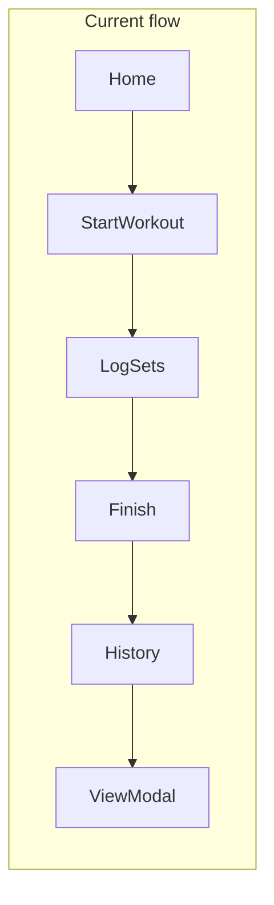
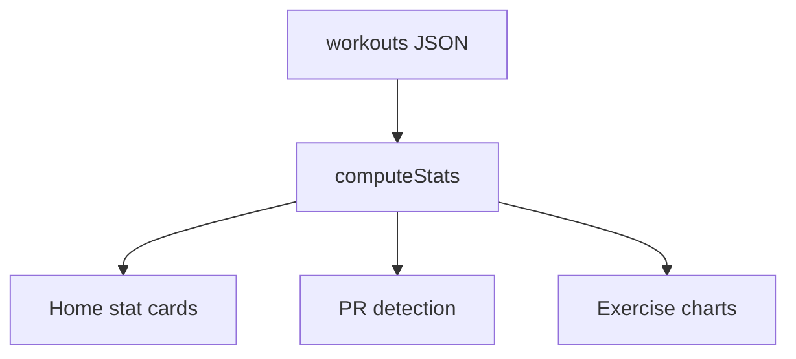

# IRON LOG Feature Roadmap

## Current baseline

The app already delivers a solid core loop: auth, live workouts, templates, exercise library, last-session hints, drag-to-reorder, pause/resume timer, active-workout resume, CSV export, and debounced sync via JSON blobs in [`app.py`](app.py) and localStorage in [`templates/index.html`](templates/index.html).



**Notable gaps today**

| Area | What exists | What's missing |
|------|-------------|----------------|
| In-session | Last-session chips, set checkmarks | Rest timer, repeat-set, pre-fill targets |
| Progress | Chart.js script tag (unused) | Charts, PRs, volume/streak stats |
| History | Last 10 cards + read-only modal | Edit/delete, search, repeat workout |
| Calendar | Dots + `alert()` tooltip | Tap day → list workouts |
| Data model | Flexible JSON per user | Structured fields for analytics (notes, RPE, units) |

Most high-impact features can ship **frontend-only** by extending the existing workout JSON shape and reusing `debounceSync()` — no schema migration required initially.

---

## Phase 1 — In-gym experience (highest ROI)

These improve the app **while you're lifting**, which is when UX matters most.

### 1. Rest timer between sets
After marking a set complete (`toggleSet`), start a countdown (default 90s, user-configurable per exercise or globally). Show a sticky bar with skip/+30s. Persist rest preference in localStorage (`ironlog_settings`).

**Touch points:** `toggleSet`, new `restTimer` state, small settings object synced optionally via new `settings_json` column or piggyback on `sync_data`.

### 2. "Repeat last set" / pre-fill targets
Add a **Copy last** button on each exercise row that copies the previous set's weight/reps/time into the next empty set. Optionally pre-fill new sets from `getLastSession()` values on add-set.

**Touch points:** `addSet`, set row UI in workout render (~line 434 in [`templates/index.html`](templates/index.html)).

### 3. Smart set completion
When user fills weight + reps and tabs out, auto-check the set (optional setting). Reduces taps on mobile.

### 4. Workout summary screen on finish
Replace immediate jump to home with a short summary modal:
- Total duration, exercise count, set count
- Total volume (weight × reps for completed sets)
- Any new PRs hit this session (see Phase 2)

**Touch points:** `finishWorkout()` (~line 922).

---

## Phase 2 — Progress and motivation

Chart.js is already loaded but never instantiated — this is the biggest "free win" in the codebase.

### 5. Personal records (PRs)
Compute per-exercise bests from `workouts` history:
- Max weight (per rep bracket, e.g. 1RM estimate optional later)
- Max reps at a given weight
- Best time (for timed exercises)

Show a **PR badge** on set rows when a value beats history; celebrate on the finish summary.

**Implementation:** Pure client-side helper `getPersonalBests(exerciseId, history)` — no backend change.

### 6. Exercise progress charts
New sub-view under **Exercises** tab (or tap exercise name in library):
- Line chart: max weight over time
- Bar chart: weekly set volume
- Filter: last 4 / 12 / 52 weeks

Uses existing Chart.js CDN; data from flattened workout history.

### 7. Home dashboard stats
Above "Recent History" on home:
- **Streak:** consecutive days with a logged workout
- **This week:** workout count, total volume, total minutes
- **Last PR:** most recent record with exercise name



### 8. Calendar that actually works
Replace `showDay()` alert with a bottom sheet listing that day's workouts; tap to open existing `viewWorkoutDetails` flow. Add optional "rest day" manual marking later.

---

## Phase 3 — History and data quality

### 9. Edit and delete past workouts
In `viewWorkoutDetails` modal, add **Edit** (reopen as read-only active workout or inline edit) and **Delete** with confirm. Sync via existing `/sync_data`.

### 10. Repeat / clone workout
From history detail or home card: **Do again** — clone exercises/sets structure (cleared completion) into a new active workout, same as `startFromTemplate` logic.

### 11. Save past workout as template
Button in history modal → push to `templates` array (mirror `finishWorkout` template prompt).

### 12. Workout and set notes
Extend workout object:
```js
{ notes: "", exercises: [{ notes: "", sets: [...] }] }
```
Simple textarea on workout header and optional per-exercise note. Include in CSV export in [`app.py`](app.py) `export_data`.

### 13. Units preference (lbs / kg)
Store `preferredUnit` in settings; display labels accordingly. No conversion of old data required initially — label-only switch.

---

## Phase 4 — Planning and library depth

### 14. Muscle groups / categories
Add optional `muscleGroup` on exercises (Push, Pull, Legs, Core, Cardio, etc.). Filter exercise search modal and library list.

### 15. Template improvements
- **Duplicate template** button
- **Default set count** per exercise in template (already partially there via `sets.length`)
- **Template from program slot:** name templates "Mon Push", "Wed Pull" for quick weekly rhythm

### 16. Simple weekly program view (lightweight)
New nav tab or home section: assign templates to weekdays (Mon–Sun). On home, surface **Today's suggested workout** if a template is assigned. No complex periodization — just a weekly map stored in `program_json` or localStorage.

### 17. RPE / effort (optional field)
Toggle in settings to show RPE (1–10) column on sets. Stored on set object; useful for autoregulation without building full program logic.

---

## Phase 5 — Polish and platform

Lower priority unless you're deploying widely:

| Feature | Why |
|---------|-----|
| PWA (manifest + service worker) | Install to home screen; offline read of last sync |
| Password change / reset | Auth is minimal today (`user_id` in localStorage) |
| Structured DB tables | Only if JSON blobs become slow for analytics |
| Superset / circuit grouping | Was removed previously; re-add only if requested |
| Plate calculator | Nice for barbell users; small modal |
| Import CSV | Pair with existing export |

---

## Recommended build order

```mermaid
gantt
  title Suggested implementation order
  dateFormat X
  axisFormat %s
  section Session
    Rest timer           :0, 1
    Repeat last set      :1, 1
    Finish summary       :2, 1
  section Progress
    PR detection         :3, 1
    Home stats           :4, 1
    Exercise charts      :5, 2
    Calendar drilldown   :6, 1
  section History
    Edit delete workouts :7, 1
    Repeat clone workout :8, 1
    Notes and units      :9, 2
  section Planning
    Muscle groups        :10, 1
    Weekly program       :11, 2
```



**Start with Phase 1 (rest timer + repeat set + finish summary)** — they reuse existing workout state, need no API changes, and directly improve every session.

**Then Phase 2 (PRs + charts + stats)** — Chart.js is already on the page; PR logic unlocks motivation with minimal new UI.

---

## Data model additions (incremental)

Keep backward compatibility with `safe_load` defaults in [`app.py`](app.py):

```js
// Workout (existing + new optional fields)
{
  name, type, date, duration, startTime, exercises,
  notes: ""  // new
}

// Set (existing + new optional fields)
{
  weight, reps, time, completed,
  rpe: null,      // new, optional
  setType: "working"  // new: "warmup" | "working" | "drop"
}

// New localStorage / sync keys
settings: { restSeconds: 90, autoCompleteSet: false, unit: "lbs" }
program: { mon: templateId, wed: templateId, ... }
```

Optional backend: add `settings_json` and `program_json` columns to `User` model (same pattern as `templates_json`).

---

## What to skip for now

- Full 1RM formulas, mesocycle periodization, social features, wearable integrations — high complexity, low fit for current architecture.
- Rewriting to React/native app — the monolithic SPA is fine until file size or maintainability becomes painful.
- Re-adding supersets before rest timer and PRs — session flow improvements pay off faster.
